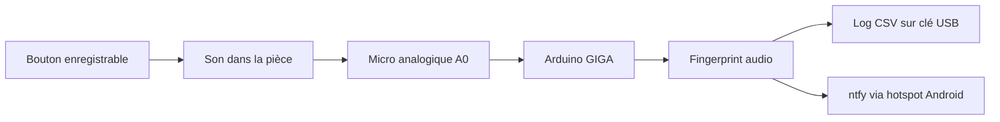

# Talking Pet Buttons - écoute audio portable

Ce projet transforme un Arduino GIGA R1 WiFi en boîtier d'écoute pour boutons
enregistrables indépendants. Les boutons ne sont pas modifiés : le GIGA écoute
leur son avec un micro analogique, reconnaît chaque bouton par empreinte audio,
journalise les appuis sur une clé USB et envoie une notification `ntfy` via le
hotspot Android.

## Principe



La V1 vise 6 à 8 boutons sur 2 tiles de yoga. Chaque bouton est placé dans un
support imprimé en 3D de type cylindre creux : une petite protubérance
intérieure suspendue porte le bouton, la zone sous le haut-parleur reste
dégagée, et les évents latéraux orientent le son vers le micro.

## Contenu du projet

- `src/main.cpp` : firmware PlatformIO pour Arduino GIGA R1 WiFi.
- `usb/config/` : exemples de fichiers à copier sur la clé USB.
- `hardware/button-riser.stl` : support 3D prêt pour PrusaSlicer.
- `hardware/button-riser.scad` : source paramétrique OpenSCAD du support.
- `docs/01-mise-en-route.md` : démarrage, firmware, USB, placement et calibration.
- `docs/02-liste-achats.md` : matériel recommandé pour la V1.
- `docs/03-agencement.md` : placement des tiles, du GIGA, du micro et des boutons.
- `docs/04-cablage.md` : câblage minimal du micro et de l'alimentation.
- `docs/05-schemas-branchement.md` : branchements micro, USB, alimentation et flux.
- `docs/06-cle-usb.md` : structure de la clé USB et formats des fichiers.
- `docs/07-calibration.md` : apprentissage des boutons avec les commandes série.
- `docs/08-tests.md` : checklist de validation avant usage quotidien.
- `hardware/01-support-3d.md` : support imprimable et réglages PrusaSlicer.
- `audio/01-audio.md` : notes sur les données audio utilisées par la V1.
- `docs/images/` : schémas SVG exportables/imprimables.

## Matériel V1

- Arduino GIGA R1 WiFi.
- Module micro analogique 3.3 V à gain réglable, type MAX4466.
- Clé USB-A FAT32.
- Batterie externe USB-C ou chargeur USB-C.
- Téléphone Android avec hotspot et application `ntfy`.
- 6 à 8 boutons enregistrables indépendants.
- 2 tiles de yoga emboîtables.
- Supports imprimés en 3D, un par bouton.
- Option : panneau de calibration avec 3 boutons NO et 6 LEDs binaires.

## Démarrage rapide

1. Copier `usb/config/buttons.csv`, `usb/config/settings.ini` et un
   `secrets.ini` basé sur `usb/config/secrets.example.ini` à la racine d'une
   clé USB FAT32, en gardant les dossiers.
2. Brancher le micro :
   - `VCC` vers `3V3` ;
   - `GND` vers `GND` ;
   - `OUT` vers `A0`.
3. Brancher la clé USB dans le port USB-A du GIGA.
4. Alimenter le GIGA en USB-C.
5. Compiler et téléverser avec PlatformIO.
6. Ouvrir le moniteur série à `115200` bauds, ou utiliser
   `pio device monitor -b 115200`.
7. Lancer `cal A1 12`, puis presser le bouton A1 12 fois.
8. Répéter pour chaque bouton.
9. Lancer `testntfy`, puis vérifier l'application Android.

## Commandes série

```text
help              affiche les commandes
list              affiche les boutons et templates chargés
status            affiche USB, Wi-Fi, heure, bruit, sélection et calibration
reload            recharge la config et les templates depuis la clé USB
select N          règle la sélection du panneau ; 0 éteint les LEDs binaires
ledtest N         affiche une valeur brute 0..63 sur les LEDs binaires
cal A1 [12]       apprend les prochains appuis pour le slot A1
cancel            annule une calibration active
testntfy          envoie une notification de test
```

Le panneau de calibration optionnel utilise `D22` pour `CAL`, `D23` pour `+`,
`D24` pour `-`, et `D25` à `D30` pour les 6 LEDs binaires. L'état `000000`
signifie qu'aucun bouton animal n'est sélectionné.

## Important

- Le GIGA ne fait pas de reconnaissance vocale générale. Il compare des sons de
  boutons déjà appris.
- Si tu réenregistres le message d'un bouton, il faut refaire sa calibration.
- Si tu changes fortement la position du micro ou des boutons, refais au moins
  un test de précision.
- Les notifications sont mises en attente dans `/queue/ntfy-pending.jsonl` si le
  hotspot est indisponible.
