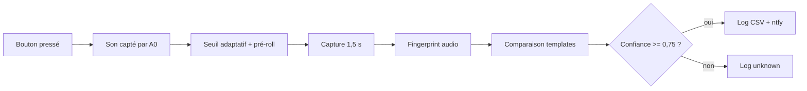

# Schémas de branchement et flux

## Vue générale


```text
Téléphone Android hotspot ))) Wi-Fi ))) Arduino GIGA ))) HTTPS ))) ntfy
                                             |
USB-C power bank ----------------------------+
                                             |
Clé USB FAT32 ---- USB-A GIGA ---------------+
                                             |
Micro analogique ---- A0 / 3V3 / GND --------+
```

Le GIGA ne touche pas aux boutons. Les boutons restent indépendants, avec leur
pile et leur propre message enregistré.

## Branchement micro


```text
Module micro analogique        Arduino GIGA

VCC  ------------------------>  3V3
GND  ------------------------>  GND
OUT  ------------------------>  A0
```

Règles :

- alimenter le micro en `3V3` ;
- ne jamais envoyer de `5V` sur `A0` ;
- garder les fils courts ;
- régler le gain pour qu'un bouton fort ne sature pas le signal.

## Bouton service optionnel

Le firmware réserve `D22` pour un bouton service futur. La V1 utilise surtout le
moniteur série pour éviter une interface trop ambiguë.

```text
Bouton service optionnel       Arduino GIGA

borne 1 --------------------->  D22
borne 2 --------------------->  GND
```

## Support audio du bouton


Objectif : que le bouton repose dans un cylindre creux, sur une petite
protubérance intérieure suspendue, pendant que la zone sous le haut-parleur
reste ouverte au lieu d'être absorbée par la tile de yoga.

Le support recommandé :

- parois droites ;
- cylindre creux simple, sans plancher central ;
- protubérance intérieure à 7 mm de haut environ ;
- protubérance de quelques millimètres d'épaisseur et de profondeur ;
- cette protubérance ne descend pas jusqu'en bas du cylindre ;
- chambre centrale ouverte sous le haut-parleur ;
- 3 a 4 évents latéraux connectés à cette chambre d'air ;
- un évent plus large orienté vers le micro ;
- Velcro ou patins caoutchouc dessous.

Le fichier prêt pour PrusaSlicer est :

```text
hardware/button-riser.stl
```

La source modifiable reste :

```text
hardware/button-riser.scad
```

## Flux logiciel



Si le Wi-Fi ou le hotspot n'est pas disponible, l'événement reconnu est ajouté à :

```text
/queue/ntfy-pending.jsonl
```

Le GIGA renvoie cette file au retour du Wi-Fi.
