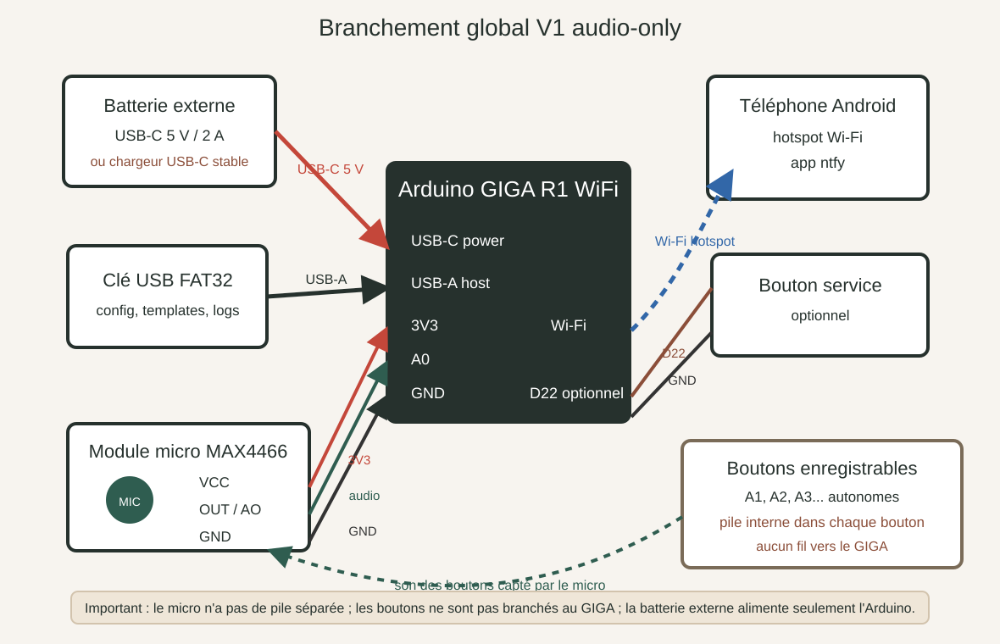
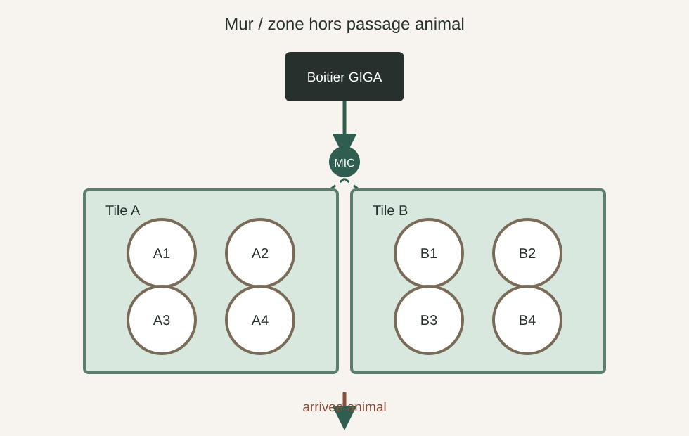
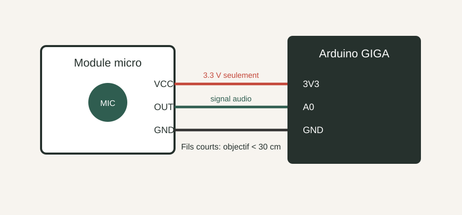
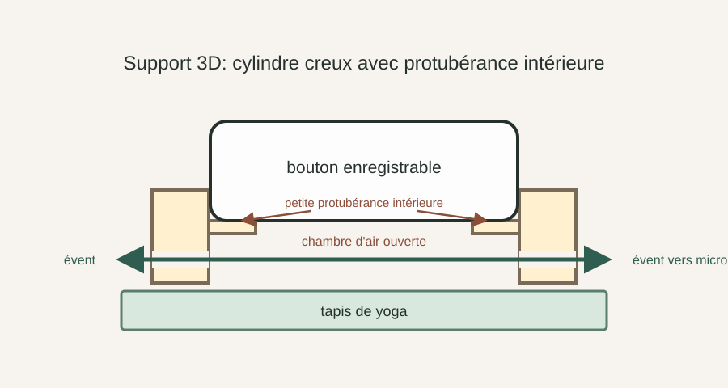
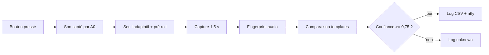

# Schémas de branchement et flux

## Vue générale



Ce schéma montre les branchements réels à faire. Le point important : les piles
des boutons enregistrables restent dans les boutons. Elles ne servent pas à
alimenter l'Arduino. Le GIGA est alimenté séparément par USB-C, idéalement avec
une batterie externe ou un chargeur USB-C stable.

```text
Batterie externe USB-C 5 V
        |
        v
Arduino GIGA R1 WiFi
   | USB-A  -> clé USB FAT32
   | 3V3    -> VCC du micro MAX4466
   | A0     -> OUT / AO du micro MAX4466
   | GND    -> GND du micro MAX4466
   | Wi-Fi  -> hotspot Android -> ntfy
   | D22    -> bouton CAL vers GND
   | D23    -> bouton + vers GND
   | D24    -> bouton - vers GND
   | D25-D30 -> 6 LEDs binaires avec résistances 1 kΩ

Boutons enregistrables
   | piles internes
   | aucun fil vers le GIGA
   v
son capté par le micro
```



```text
Téléphone Android hotspot ))) Wi-Fi ))) Arduino GIGA ))) HTTPS ))) ntfy
                                             |
USB-C power bank ----------------------------+
                                             |
Clé USB FAT32 ---- USB-A GIGA ---------------+
                                             |
Micro analogique ---- A0 / 3V3 / GND --------+
```

Le GIGA ne touche pas aux boutons. Les boutons restent indépendants, avec leur
pile et leur propre message enregistré. La seule liaison entre les boutons et le
GIGA est acoustique : le bouton joue son message, puis le micro le capte.

## Branchement micro



```text
Module micro analogique        Arduino GIGA

VCC  ------------------------>  3V3
GND  ------------------------>  GND
OUT  ------------------------>  A0
```

Règles :

- alimenter le micro en `3V3` ;
- ne jamais envoyer de `5V` sur `A0` ;
- garder les fils courts ;
- régler le gain pour qu'un bouton fort ne sature pas le signal.

Le micro n'a pas besoin de pile séparée : il est alimenté par le `3V3` du GIGA.

## Panneau de calibration optionnel

Le panneau de calibration permet de choisir et calibrer un bouton animal sans
ordinateur. Les commandes série restent disponibles.

```text
Boutons électriques NO         Arduino GIGA

CAL borne 1 ----------------->  D22
CAL borne 2 ----------------->  GND

+ borne 1 ------------------->  D23
+ borne 2 ------------------->  GND

- borne 1 ------------------->  D24
- borne 2 ------------------->  GND
```

Ces boutons utilisent `INPUT_PULLUP`, donc aucune résistance externe n'est
nécessaire pour eux.

```text
LEDs binaires                 Arduino GIGA

bit 1  LED + résistance 1 kΩ  D25
bit 2  LED + résistance 1 kΩ  D26
bit 4  LED + résistance 1 kΩ  D27
bit 8  LED + résistance 1 kΩ  D28
bit 16 LED + résistance 1 kΩ  D29
bit 32 LED + résistance 1 kΩ  D30
```

Ordre de lecture recommandé de gauche à droite : `32 16 8 4 2 1`, donc
`D30 D29 D28 D27 D26 D25`. L'état `000000` signifie qu'aucun bouton animal n'est
sélectionné.

## Support audio du bouton



Objectif : que le bouton repose dans un cylindre creux, sur une petite
protubérance intérieure suspendue, pendant que la zone sous le haut-parleur
reste ouverte au lieu d'être absorbée par la tile de yoga.

Le support recommandé :

- parois droites ;
- cylindre creux simple, sans plancher central ;
- protubérance intérieure à 7 mm de haut environ ;
- protubérance de quelques millimètres d'épaisseur et de profondeur ;
- cette protubérance ne descend pas jusqu'en bas du cylindre ;
- chambre centrale ouverte sous le haut-parleur ;
- 3 à 4 évents latéraux connectés à cette chambre d'air ;
- un évent plus large orienté vers le micro ;
- Velcro ou patins caoutchouc dessous.

Le fichier prêt pour PrusaSlicer est :

```text
hardware/button-riser.stl
```

La source modifiable reste :

```text
hardware/button-riser.scad
```

## Flux logiciel



Si le Wi-Fi ou le hotspot n'est pas disponible, l'événement reconnu est ajouté à :

```text
/queue/ntfy-pending.jsonl
```

Le GIGA renvoie cette file au retour du Wi-Fi si `auto_queue_flush=true`. En
mode diagnostic, garder `auto_queue_flush=false` et tester d'abord `wifi`, `ntp`,
puis `testntfy`.
