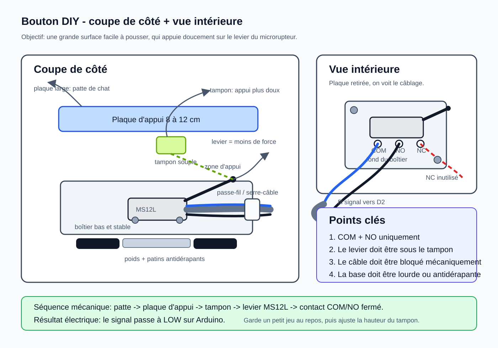

# Câblage

## Câblage d'un bouton

Chaque bouton est un interrupteur normalement ouvert.

```text
Arduino GIGA input pin ---- COM  bouton  NO ---- GND Arduino
```

Le sketch utilise `INPUT_PULLUP`:

- bouton non appuye: l'entrée lit `HIGH`;
- bouton appuye: l'entrée est reliée a `GND` et lit `LOW`.

Il ne faut pas ajouter de 5 V dans ce circuit.

## Mapping des 24 boutons

| Bouton | Pin | Mot        | Fichier WAV   |
|--------|-----|------------|---------------|
| 1      | D2  | manger     | `MANGER.WAV`  |
| 2      | D3  | eau        | `EAU.WAV`     |
| 3      | D4  | jouer      | `JOUER.WAV`   |
| 4      | D5  | dehors     | `DEHORS.WAV`  |
| 5      | D6  | dedans     | `DEDANS.WAV`  |
| 6      | D7  | calin      | `CALIN.WAV`   |
| 7      | D8  | brosser    | `BROSSER.WAV` |
| 8      | D9  | dormir     | `DORMIR.WAV`  |
| 9      | D10 | oui        | `OUI.WAV`     |
| 10     | D11 | non        | `NON.WAV`     |
| 11     | D12 | aide       | `AIDE.WAV`    |
| 12     | D13 | encore     | `ENCORE.WAV`  |
| 13     | D14 | fini       | `FINI.WAV`    |
| 14     | D15 | litiere    | `LITIERE.WAV` |
| 15     | D16 | friandise  | `FRIAND.WAV`  |
| 16     | D17 | ouvrir     | `OUVRIR.WAV`  |
| 17     | D18 | voir       | `VOIR.WAV`    |
| 18     | D19 | venir      | `VENIR.WAV`   |
| 19     | D20 | mal        | `MAL.WAV`     |
| 20     | D21 | content    | `CONTENT.WAV` |
| 21     | D22 | peur       | `PEUR.WAV`    |
| 22     | D23 | toi        | `TOI.WAV`     |
| 23     | D24 | moi        | `MOI.WAV`     |
| 24     | D25 | maintenant | `MAINT.WAV`   |

## Bouton DIY recommande

Structure simple:



1. Base lourde ou antidérapante.
2. Microrupteur MS12L fixe dans la base.
3. Grande plaque d'appui de 8 a 12 cm au-dessus du levier.
4. Deux fils soudes sur `COM` et `NO`.
5. Sortie de cable protegee par passe-fil, serre-cable ou noeud interne.

## Boite centrale

Option simple pour commencer:

- amener chaque cable deux fils dans la boite centrale;
- connecter le fil signal au bornier du pin correspondant;
- connecter tous les fils retour au rail `GND`;
- garder Arduino, borniers, cle USB et audio dans la boite.

Option plus maintenable:

- ajouter des connecteurs 2 broches amovibles par bouton;
- étiqueter chaque connecteur avec le numero de bouton;
- garder une reserve de pins libres pour agrandir le vocabulaire.

## Audio

Le sketch lance deux DAC (`A12` et `A13`) avec le meme signal mono, pour avoir
du son sur les deux canaux du jack quand l'enceinte attend une entree stereo.

La sortie jack du GIGA doit aller vers une entree AUX amplifiee. Ne pas brancher
de haut-parleur passif directement.
