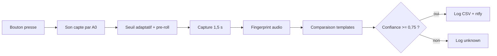

# Schemas de branchement et flux

## Vue generale


```text
Telephone Android hotspot ))) Wi-Fi ))) Arduino GIGA ))) HTTPS ))) ntfy
                                             |
USB-C power bank ----------------------------+
                                             |
Cle USB FAT32 ---- USB-A GIGA ---------------+
                                             |
Micro analogique ---- A0 / 3V3 / GND --------+
```

Le GIGA ne touche pas aux boutons. Les boutons restent independants, avec leur
pile et leur propre message enregistre.

## Branchement micro


```text
Module micro analogique        Arduino GIGA

VCC  ------------------------>  3V3
GND  ------------------------>  GND
OUT  ------------------------>  A0
```

Regles:

- alimenter le micro en `3V3`;
- ne jamais envoyer de `5V` sur `A0`;
- garder les fils courts;
- regler le gain pour qu'un bouton fort ne sature pas le signal.

## Bouton service optionnel

Le firmware reserve `D22` pour un bouton service futur. La V1 utilise surtout le
moniteur serie pour eviter une interface trop ambigue.

```text
Bouton service optionnel       Arduino GIGA

borne 1 --------------------->  D22
borne 2 --------------------->  GND
```

## Support audio du bouton


Objectif: que le son sorte du dessous du bouton au lieu d'etre absorbe par la
tile de yoga.

Le support recommande:

- hauteur 8 mm;
- trou central sous le haut-parleur;
- 3 a 4 events lateraux;
- un event plus large oriente vers le micro;
- levre basse pour eviter que le bouton glisse;
- Velcro ou patins caoutchouc dessous.

Le fichier pret pour PrusaSlicer est:

```text
hardware/button-riser.stl
```

La source modifiable reste:

```text
hardware/button-riser.scad
```

## Flux logiciel



Si le Wi-Fi ou le hotspot n'est pas disponible, l'evenement reconnu est ajoute a:

```text
/queue/ntfy-pending.jsonl
```

Le GIGA renvoie cette file au retour du Wi-Fi.
