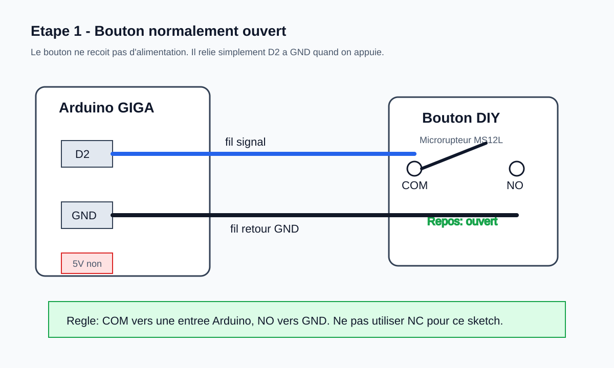
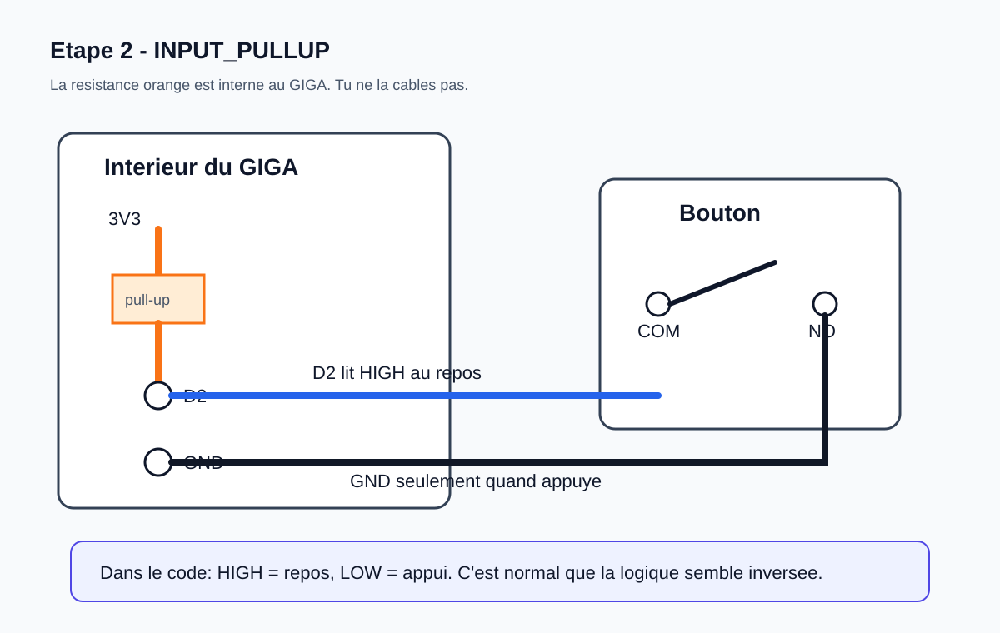
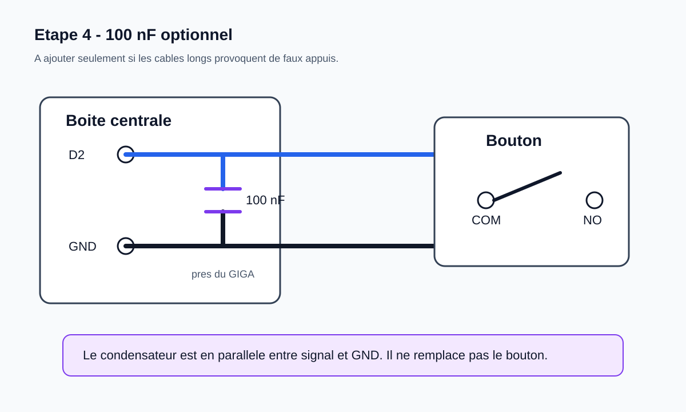
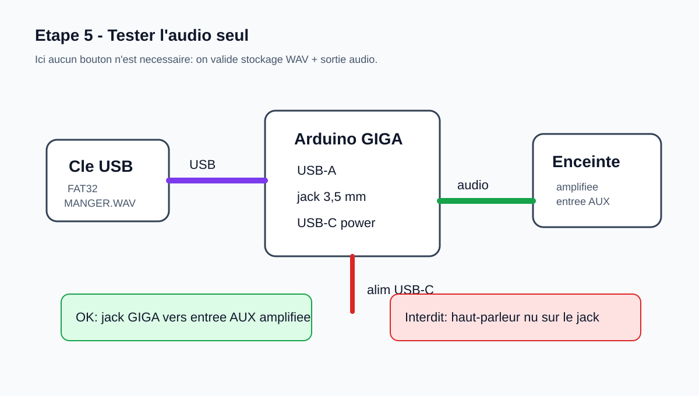
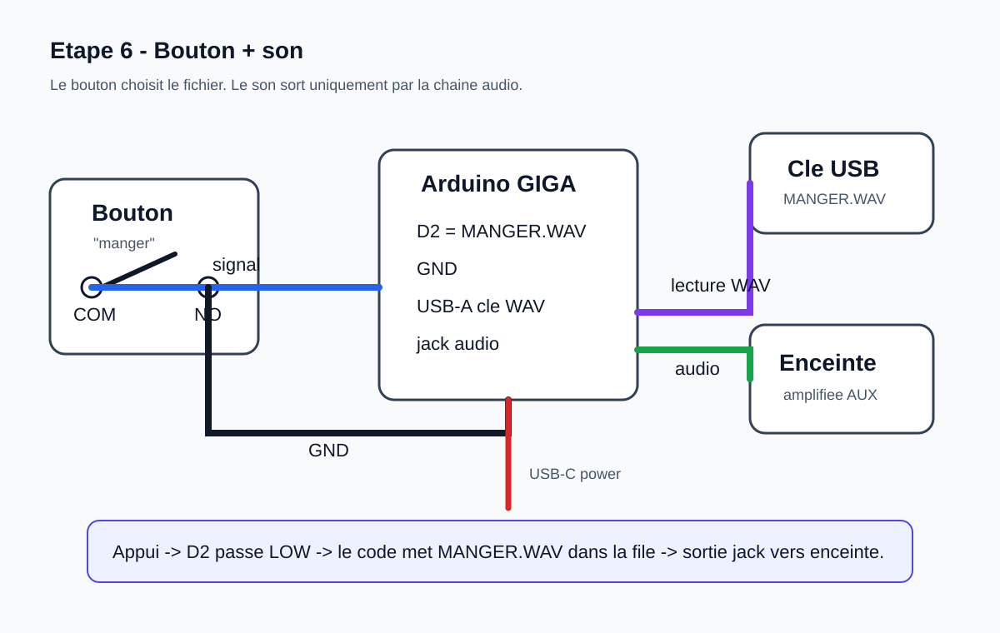
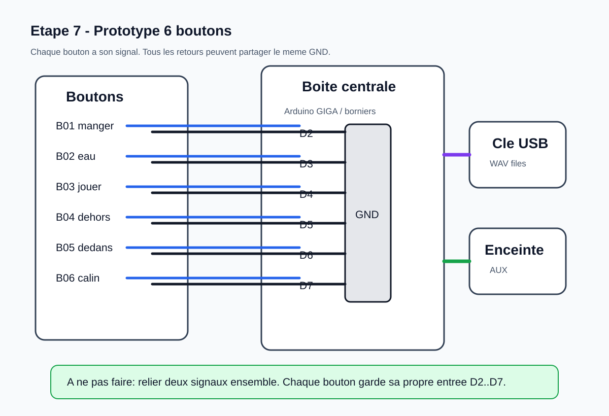
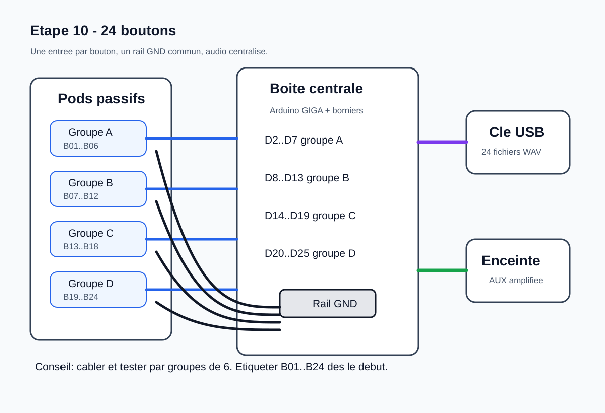
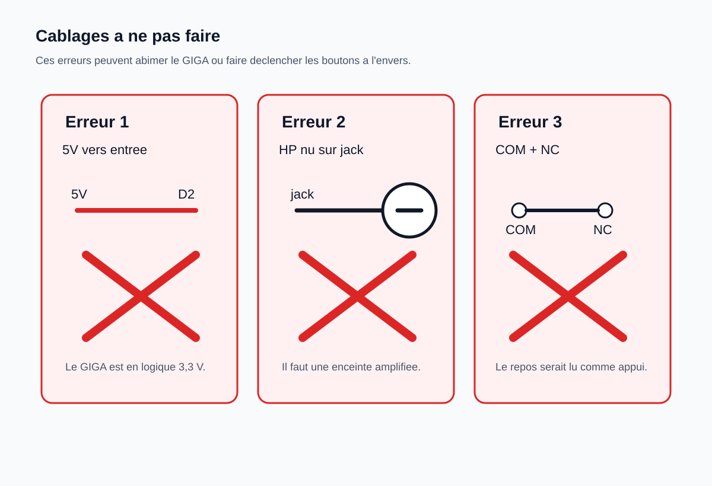

# Schemas de branchement pas a pas

Ce document montre le montage progressivement. Le principe important: les
boutons ne recoivent pas d'alimentation. Ils ferment seulement un contact entre
une entree Arduino et `GND`.

## Légende

```text
D2, D3...       entree numerique Arduino GIGA
GND             masse Arduino
3V3             alimentation logique interne du GIGA, ne pas cabler au bouton
NO              normally open / normalement ouvert
COM             commun du microrupteur
NC              normally closed / normalement ferme, a ignorer ici
o/ o            contact ouvert
o--o            contact ferme
```

## Étape 1 - Comprendre un seul bouton

Un bouton DIY est juste un interrupteur. Pour le test le plus simple:



```text
Arduino GIGA                    Microrupteur du bouton

   D2  ------------------------  COM
                                  o/ o
   GND ------------------------  NO

   3V3    non utilise
   5V     non utilise
```

Etat relache:

```text
D2  ---- COM   o/ o   NO ---- GND

Le contact est ouvert.
D2 n'est pas connecte a GND.
```

Etat appuye:

```text
D2  ---- COM   o--o   NO ---- GND

Le contact est ferme.
D2 est connecte a GND.
```

Subtilite: utiliser `COM` + `NO`, pas `COM` + `NC`.

- `NO` signifie que le bouton est ouvert au repos et ferme seulement a l'appui.
- `NC` ferait l'inverse: le bouton semblerait appuye au repos.

## Etape 2 - Pourquoi `INPUT_PULLUP` marche sans resistance externe

Dans le code, chaque pin est configuree comme ceci:



```cpp
pinMode(D2, INPUT_PULLUP);
```

Cela active une petite resistance interne entre `D2` et `3V3`.

```text
Interieur du GIGA

   3V3
    |
   [ resistance pull-up interne ]
    |
   D2  ------------------------  COM
                                  o/ o
   GND ------------------------  NO
```

Quand le bouton est relache:

```text
3V3 --[pull-up]-- D2     bouton ouvert     GND

D2 lit HIGH.
```

Quand le bouton est appuye:

```text
3V3 --[pull-up]-- D2 ---- bouton ferme ---- GND

D2 lit LOW.
Un tout petit courant passe dans la resistance interne, ce qui est normal.
```

Consequences dans le code:

- `HIGH` veut dire "pas appuye";
- `LOW` veut dire "appuye";
- il ne faut pas brancher `3V3` ou `5V` sur le bouton;
- le bouton est passif et ne consomme presque rien.

## Etape 3 - Premier test sans audio

Objectif: verifier que le bouton est bien vu par le GIGA.

```text
                       cable 2 fils
Arduino GIGA        vers bouton DIY

   D2  -------------------------------- COM
                                          o/ o
   GND -------------------------------- NO
```

Test attendu dans le moniteur serie:

```text
Pressed: manger
```

Si rien ne se passe:

- verifier que le bouton utilise `COM` et `NO`;
- verifier que le fil de retour est bien sur `GND`;
- tester la continuite au multimetre;
- essayer un fil court avant un cable long.

## Etape 4 - Ajouter un condensateur anti-parasites optionnel

Ne l'ajoute pas tout de suite. Il sert si un cable long provoque de faux appuis.



Le condensateur 100 nF se met entre l'entree et `GND`, de preference dans la
boite centrale, pres du GIGA ou du bornier.

```text
Arduino GIGA / boite centrale              Bouton

   D2  ----------------+------------------ COM
                       |                    o/ o
                    [100 nF]
                       |
   GND ----------------+------------------ NO
```

Subtilite: le condensateur est en parallele avec l'entree et `GND`.

- Il ne se met pas en serie dans le cable.
- Il ralentit legerement les transitions rapides.
- Le code fait deja un anti-rebond logiciel; le condensateur est seulement un
  filet de securite pour cables longs/bruit electrique.

## Etape 5 - Tester l'audio seul

Avant de combiner bouton et son, verifier que l'audio fonctionne seul.



```text
                 USB-A                         jack 3,5 mm
Cle USB FAT32 ---------> Arduino GIGA ----------------------> entree AUX
                         USB-C power                         enceinte amplifiee
```

Important:

- la cle USB contient les fichiers WAV a la racine;
- l'enceinte doit etre amplifiee;
- ne jamais brancher un haut-parleur passif directement au GIGA;
- le jack transporte un signal audio, pas une alimentation de haut-parleur.

## Etape 6 - Un bouton qui declenche un son

Quand bouton et audio sont valides separement, on combine.



```text
Bouton "manger"                         Audio

COM ---------------- D2                 Cle USB FAT32 ---> USB-A GIGA
 o/ o                                     GIGA jack -----> AUX enceinte
NO  ---------------- GND                GIGA USB-C -----> alimentation
```

Flux logique:

```text
appui bouton
    |
D2 passe a LOW
    |
anti-rebond logiciel
    |
ajout de MANGER.WAV dans la file audio
    |
lecture du fichier sur cle USB
    |
sortie jack vers enceinte amplifiee
```

Subtilite: l'audio et les boutons sont deux mondes separes.

- Les boutons ne transportent aucun son.
- Les boutons ne recoivent pas d'alimentation.
- Chaque bouton indique seulement au GIGA quel fichier jouer.

## Etape 7 - Prototype 6 boutons

Pour les 6 premiers mots, utiliser `D2` a `D7`.



```text
Boite centrale avec rail GND commun

Signal bouton 1  ---> D2      bouton 1 retour ---+
Signal bouton 2  ---> D3      bouton 2 retour ---+
Signal bouton 3  ---> D4      bouton 3 retour ---+
Signal bouton 4  ---> D5      bouton 4 retour ---+---- GND Arduino
Signal bouton 5  ---> D6      bouton 5 retour ---+
Signal bouton 6  ---> D7      bouton 6 retour ---+
```

Vue bouton par bouton:

```text
Bouton 1 "manger":    COM -> D2     NO -> GND
Bouton 2 "eau":       COM -> D3     NO -> GND
Bouton 3 "jouer":     COM -> D4     NO -> GND
Bouton 4 "dehors":    COM -> D5     NO -> GND
Bouton 5 "dedans":    COM -> D6     NO -> GND
Bouton 6 "calin":     COM -> D7     NO -> GND
```

Subtilite du rail `GND`:

- tous les retours peuvent partager le meme `GND`;
- chaque signal doit avoir sa propre entree Arduino;
- ne pas relier deux signaux ensemble;
- etiqueter les cables des le debut.

## Etape 8 - Boite centrale avec borniers

Avec un shield a borniers, la boite devient plus propre.

```text
                 Boite centrale

  Cable bouton 1     +----------------------+
  signal ------------| bornier D2           |
  retour ------------| rail GND             |
                     |                      |
  Cable bouton 2     | Arduino GIGA +       |
  signal ------------| shield a borniers    |
  retour ------------| rail GND             |
                     |                      |
  Cable bouton 3     | USB-A cle WAV        |
  signal ------------| jack audio vers AUX  |
  retour ------------| rail GND             |
                     +----------------------+
```

Subtilites mecaniques:

- ajouter une decharge de traction pour chaque cable;
- ne pas laisser les borniers porter l'effort si l'animal tire le cable;
- separer les cables boutons de l'alimentation si possible;
- garder la cle USB et le jack audio inaccessibles aux animaux.

## Etape 9 - Connecteurs amovibles optionnels

Si tu veux pouvoir deplacer ou remplacer les boutons, ajoute un connecteur deux
broches par bouton entre le pod et la boite centrale.

```text
Bouton DIY                  Connecteur 2 broches             Boite centrale

COM ---------------------- pin 1  o====o  pin 1 ------------ D2
NO  ---------------------- pin 2  o====o  pin 2 ------------ GND
```

Regle d'etiquetage:

```text
B01 -> D2  -> MANGER.WAV
B02 -> D3  -> EAU.WAV
B03 -> D4  -> JOUER.WAV
...
```

Subtilite: le connecteur n'a pas de polarite electrique stricte pour un simple
interrupteur, mais il faut garder une convention stable pour le diagnostic:

- broche 1 = signal;
- broche 2 = GND.

## Etape 10 - Extension a 24 boutons

Le principe ne change pas: une entree par bouton, un rail `GND` commun.



```text
Boutons 1..24                   Arduino GIGA

B01 signal -------------------- D2
B02 signal -------------------- D3
B03 signal -------------------- D4
...
B23 signal -------------------- D24
B24 signal -------------------- D25

B01 retour ---+
B02 retour ---+
B03 retour ---+
...           +---------------- GND
B23 retour ---+
B24 retour ---+
```

Vue fonctionnelle:

```text
24 pods passifs
      |
      | 24 signaux + retours GND
      v
boite centrale / borniers
      |
      | entrees D2..D25
      v
Arduino GIGA
      |
      | fichier WAV correspondant
      v
cle USB
      |
      | jack audio
      v
enceinte amplifiee
```

Subtilites quand on passe a 24:

- garder les cables par paires signal+GND, idealement torsades;
- eviter les nappes longues ou tous les signaux courent sans leur GND;
- faire des groupes de 6 ou 8 boutons pour rester lisible;
- tester chaque bouton avant de fermer la boite centrale;
- garder une liste papier ou un tableau `bouton -> pin -> fichier`.

## Etape 11 - Ce qu'il ne faut pas cabler

Ces schemas sont volontairement faux:



```text
FAUX: envoyer 5 V vers une entree

5V ---- bouton ---- D2
```

Le GIGA est en logique 3,3 V. Une entree n'est pas faite pour recevoir 5 V.

```text
FAUX: brancher un haut-parleur passif sur le jack

GIGA jack ---- haut-parleur nu
```

Le jack n'est pas un ampli. Il faut une enceinte amplifiee ou un module ampli.

```text
FAUX: utiliser COM + NC pour les boutons du sketch actuel

D2 ---- COM  o--o  NC ---- GND
```

Avec `NC`, le bouton est ferme au repos. Le code interpreterait le repos comme
un appui.

## Resume mental

```text
Bouton = contact sec
Pin Arduino = question "est-ce connecte a GND ?"
INPUT_PULLUP = reponse HIGH quand rien n'est connecte
Appui = connexion a GND = LOW
Audio = gere uniquement par le GIGA et l'enceinte
```
